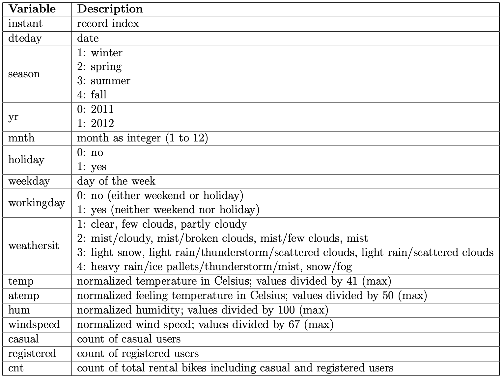
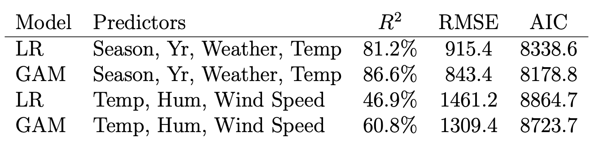

The objective of this analysis is to illustrate kernel density estimation and a generalized additive model using kernel regression.

### Introduction

Bike-sharing systems provide a relatively new generation of transportation, in which users can conveniently rent and return bikes at various stations throughout many different cities for shared use. In 2022, bike-sharing systems were available in approximately 3000 cities around the world.

Implications of the rise in popularity of bike-sharing include those related to traffic, the environment, and health. The first bike-sharing systems were initiated to promote non-polluting forms of transportation. Today, people are motivated to use bike-sharing systems for a number of reasons, including to save money or to have a sustainable alternative for short-distance transportation. Bike-sharing systems also have the potential to reduce traffic congestion and positively affect the mental and physical health of users. However, bike-sharing systems have been criticized because they can clutter streets and sidewalks and can divert tax money away from other services.

### Data

A historical log of bicycle-sharing rental data for 2011 to 2012 was sourced from the [UC Irvine Machine Learning Repository](https://archive.ics.uci.edu/dataset/275/bike+sharing+dataset). The data comes from Capital Bikeshare, a bicycle-sharing system serving Washington, D.C. that opened in 2010. By February 2011, Capital Bikeshare had 114 stations and by September 2012, they expanded to 288 stations and 2,800 bikes.

```{r, echo=FALSE, out.width = '75%'}

```

The data on the number of bike rentals was aggregated on a daily basis and corresponding weather and seasonal information were gathered. A description of the 16 available variables in the data with 730 observations (one row for each day for two years) is shown in the table above. Explanatory variables of important note include the date, season, year, month, whether or not the day was a holiday, the day of the week, whether or not it was a working day, weather conditions, temperature, feeling temperature, humidity, and wind speed. Here, the response variable is the count of total rented bikes for a given day.

### EDA

```{r, include=FALSE}
library(swipeR)
library(htmltools)
library(base64enc)

# List your image files
image_files <- c("img/bike_sharing/404_proj_cnthist.png", "img/bike_sharing/404_proj_cntdate.png", "img/bike_sharing/404_proj_yr.png", "img/bike_sharing/404_proj_season.png", "img/bike_sharing/404_proj_yrandseason.png", "img/bike_sharing/404_proj_mnth.png", "img/bike_sharing/404_proj_weekday.png", "img/bike_sharing/404_proj_holiday.png", "img/bike_sharing/404_proj_workingday.png", "img/bike_sharing/404_proj_weather.png", "img/bike_sharing/404_proj_realtemphist.png", "img/bike_sharing/404_proj_realfeelingtemphist.png", "img/bike_sharing/404_proj_realhum.png", "img/bike_sharing/404_proj_realwshist.png", "img/bike_sharing/404_proj_cnttemp.png", "img/bike_sharing/404_proj_tempseason.png", "img/bike_sharing/404_proj_cnthum.png", "img/bike_sharing/404_proj_cntws.png")

# Encode images to base64
b64_images <- lapply(image_files, function(f) dataURI(file = f, mime = "image/png"))

# Create image tags for the carousel
image_tags <- lapply(b64_images, function(b) tags$img(src = b, style = "width: auto; margin: auto;"))
```

```{r, echo=FALSE}
wrapper <- swipeRwrapper(image_tags)
swipeR(wrapper, height = "400px", navigation = TRUE)
```

There were no missing values in the data. Thus, data cleaning and preparation consisted of converting columns to appropriate data types, e.g. converting the variables season, year, month, holiday, weekday, working day, and weather to factors. Conducting linear regression in R uses these factors as dummy variables, so explicitly encoding the factors for regression was accounted for. Moreover, documentation for the data indicated the wrong codes (1-4) for the season column, e.g. we found that "1" in the season column actually indicated winter and not spring by looking at the month column.

Preliminary exploratory data analysis is illustrated in the image gallery above. The histogram of the daily rented bike count shows a range of 22 to 8714. Daily rentals that amounted to 4000-5000 occurred the most frequently in the data, with a median daily rental count of 4548.

#### Number of Rentals and Time of Year

From the plot of number of daily rented bikes by date, we can deduce that there was an increase in rentals in 2012 and there was a trend for both years of a peak occurring around July.

To further investigate these trends, we can look into the number of rentals separated by year, season, and month. It seems that these visualizations can verify some of our initial suppositions while giving us more insights. We can see that 2012 saw an increase in the median number of bike rentals. For both years, a low in rentals occurred in winter, with a high in summer. Looking at individual months for both years, January had the lowest amount of rentals while July had the highest median number of rentals. We can hypothesize that the increase in 2012 may be due to company growth and expansion and the increase during the summer can be associated with season-related weather conditions and temperature.

Further, we can see that the number of rentals were fairly even across all days of the week and that the median number of rentals was higher during non-holidays.

#### Number of Rentals and Weather

The above image gallery also visualizes the number of rentals by weather quality, which is denoted clear or cloudy, misty, or light rain or snow. These results make intuitive sense, assuming most users are more inclined to use bikes on clear days and may look at alternative forms of transportation during rain or snow.

The original variables temperature and feeling temperature in the data were normalized. Based on the documentation for the data, we calculated the real temperature by multiplying by 41 and feeling temperature by multiplying by 50 for easier interpretation during preliminary data analysis. We followed a similar procedure to calculate the real humidity and wind speed from the original variables. Based on the histograms of temperature and feeling temperature, the temperature ranged from around 2 to 35 degrees Celsius with the feeling temperature ranging from around 4 to 42. Most temperatures were around 10 to 30 degrees. The histogram of the humidity shows a left skew with the most occurrence of around 60%. The histogram of the wind speed shows a right-skew with the median around 12 mph.

Based on the plot of daily rentals vs. temperature,it appears that there is a general positive relationship between the number of rentals and the temperature. However, as temperatures rise to 30 degrees Celsius or above, there is a negative relationship with the number of rentals. To look into this further, we turn to the next plot of temperature by season, which makes intuitive sense as temperatures peak in the summer. Moreover, it also gives us some initial insight as to why rentals increase during certain months and seasons, which can possibly show the strong correlation among rentals and season, month, and temperature. The plots of daily rentals vs. humidity and vs. windspeed show some potential outliers but there is no readily apparent relationship between rentals and humidity or wind speed.

### Statistical Analysis

We will now conduct a formal analysis and further explore the relationships between the daily number of bike rentals and explanatory variables.

#### Kernel Density Estimation

```{r, include=FALSE}
# List your image files
image_files <- c("img/bike_sharing/404_proj_kdecnt.png", "img/bike_sharing/404_proj_kdecntbyseason.png", "img/bike_sharing/404_proj_kde_winter.png", "img/bike_sharing/404_proj_kde_spring.png", "img/bike_sharing/404_proj_kde_summer.png", "img/bike_sharing/404_proj_kde_fall.png")

# Encode images to base64
b64_images <- lapply(image_files, function(f) dataURI(file = f, mime = "image/png"))

# Create image tags for the carousel
image_tags <- lapply(b64_images, function(b) tags$img(src = b, style = "width: auto; margin: auto;"))
```

```{r, echo=FALSE}
wrapper <- swipeRwrapper(image_tags)
swipeR(wrapper, height = "400px", navigation = TRUE)
```

In order to estimate the probability density function of the count of bike rentals, we performed kernel density estimation in R and C. In the first kernel density estimate plot above, the black line denotes the kernel density estimate and the red dashed lines denote the 95% confidence bands.

One observation gathered from our initial data analysis was that the number of rentals varied with seasons. We saw that bike rentals had the highest median value during summer and the least during winter. We split the data into four parts for each of the four seasons. For each season, we performed kernel density estimation of the count of bike rentals. Unsurprisingly, we see that during the winter, the number of rentals tended to be lower while during the summer, the number of rentals tended to be higher. Further, we see that there are two peaks in density during the summer occurring at just below 5000 daily rentals and just below 7500 daily rentals, in comparison to a peak in density of around 1800 rentals during the winter. The kernel density estimates for each season individually with their associated 95% confidence intervals are also shown above.

To determine if there is a statistically significant difference between the means of the number of rentals for each season, we performed ANOVA. The returned p-value was $<2 \times 10^{-16}$ and thus we reject the hypothesis that all means are equal and conclude that at least one season is different than the others. For post-hoc analysis, we then performed Tukey's HSD test, which showed that all seasons are different from each other, with the exception of spring and fall (p-value 0.378).

```{r, include=FALSE}
# List your image files
image_files <- c("img/bike_sharing/404_proj_residuals.png", "img/bike_sharing/404_proj_qq.png")

# Encode images to base64
b64_images <- lapply(image_files, function(f) dataURI(file = f, mime = "image/png"))

# Create image tags for the carousel
image_tags <- lapply(b64_images, function(b) tags$img(src = b, style = "width: auto; margin: auto;"))
```

```{r, echo=FALSE}
wrapper <- swipeRwrapper(image_tags)
swipeR(wrapper, height = "400px", navigation = TRUE)
```

To check the assumptions of normality and homoscedasticity, we refer to the figures of the residuals vs. fitted and the Q-Q plots. Based on the residuals, we can assume homogeneity of variance. Moreover, the Q-Q plot shows roughly a straight line so we can assume normality. However, we can see the presence of outliers from these plots, specifically points 442, 668, and 239.

We further investigated these outliers, which corresponded to the dates of March 17, 2012, October 29, 2012, and August 27, 2011. Looking at March 17, 2012, we see an usually high count of 7836 rentals during this winter date. We can potentially attribute this to St. Patrick's Day. President Obama attended a St. Patrick's Day celebration in Washington, D.C., the area of service in our data. One hypothesis is that since there were documented street closures during the celebration, many users opted to rent bikes to get around the city. Looking at October 29, 2012, we see that Washington, D.C. experienced a city-wide shutdown due to Hurricane Sandy. This is a likely explanation for the unusually low number of only 22 rentals that day. Lastly, the unusually low number of rentals on August 27, 2011 can potentially be attributed to the effects of Hurricane Irene. Although not directly hit, Washington, D.C. experienced particularly high wind speeds and humidity that day.

#### Linear Regression Model

For initial modeling to predict the count of rental bikes on a given day, we turn to linear regression. We split the data into training and testing sets and created multiple models with different combinations of explanatory variables. We note that some of the explanatory variables in the data may be highly correlated, such as season and month and temperature and feeling temperature. To measure multicollinearity, we used R to calculate VIF values. We found, for example, season had a VIF value of 166 and month had a value of 340. Thus, we dropped the month variable and our remaining features had VIF values of less than 3.

We landed on our final model, which was chosen with $R^2$, RMSE, AIC, and interpretability in mind. The explanatory variables used are season, year, weather quality, and feeling temperature, which are all statistically significant at the 1% level. Moreover, we see that the adjusted $R^2$ value is 0.8118, indicating a good fit. Using the test data, we got a RMSE of 915.4.

Looking at the residuals and Q-Q plots of the linear model, we see that assumptions are met as there is no pattern in the residuals vs. fitted plot and the Q-Q plot resembles a roughly straight line.

#### Generalized Additive Model

Although our linear model showed a good fit, we decided to also fit a general additive model to predict the count of daily bike rentals to allow for non-linear relationships. We used the numeric variables feeling temperature, humidity, and wind speed as the predictors. Note that when we fit the generalized additive model using kernel regression, we use only numeric variables due to the limitations of this analysis. The generalized additive model is of the form 
$\textrm{count} = f_1(\textrm{temperature}) + f_2(\textrm{humidity}) + f_3(\textrm{windspeed}) + \textrm{noise}$.

We fit the functions $f_1, f_2, f_3$ using kernel regression using residuals from the previous estimate. That is, we fit $f_1$ using kernel regression and fit $f_2$ using the resulting residuals from the previous step. We repeat this process to fit $f_3$.

```{r, include=FALSE}
# List your image files
image_files <- c("img/bike_sharing/404_proj_gam1.png", "img/bike_sharing/404_proj_gam1hist.png", "img/bike_sharing/404_proj_gam2.png", "img/bike_sharing/404_proj_gam2hist.png", "img/bike_sharing/404_proj_gam3.png", "img/bike_sharing/404_proj_gam3hist.png")

# Encode images to base64
b64_images <- lapply(image_files, function(f) dataURI(file = f, mime = "image/png"))

# Create image tags for the carousel
image_tags <- lapply(b64_images, function(b) tags$img(src = b, style = "width: auto; margin: auto;"))
```

```{r, echo=FALSE}
wrapper <- swipeRwrapper(image_tags)
swipeR(wrapper, height = "400px", navigation = TRUE)
```

The kernel regression estimate of daily rentals is shown above using feeling temperature with the associated bootstrap 95% confidence intervals, followed by a histogram of the residuals. These residuals are used in the second kernel regression using humidity as the predictor, shown in the next kernel regression estimate plot. A histogram follows of the residuals of the second kernel smoothing, which are used in the third kernel regression, using wind speed as the predictor. 

We also used R's gam() function in the mgcv package to fit a general additive model using penalized regression splines. Using smoothed feeling temperature, humidity, and wind speed as predictors for the number of daily rental bikes, our generalized additive model returned an adjusted $R^2$ value of 0.608 with all predictors statistically significant at the 1% level. To compare, we ran a linear regression model with the same predictors and got an $R^2$ value of 0.469. Only considering these variables, it appears that the relationship between the response and the explanatory variables is better explained with a non-linear relationship.

Finally, we created another generalized additive model using the gam() function. We used season, year, weather quality, and smoothed feeling temperature to predict the number of daily rental bikes to compare it to our final linear model. With all terms significant at the 1% level, this generalized additive model returned an adjusted $R^2$ value of 0.866. Due to the higher $R^2$ value, a lower RMSE, and a lower AIC value, we chose the general additive model using season, year, weather quality, and feeling temperature as our final model. A summary of the models is included below.

```{r, echo=FALSE, out.width = '65%'}

```

### Conclusion

Our analysis showed that the number of daily rentals increased from 2011 to 2012, with year being a significant predictor for the number of rentals. If Capital Bikeshare continues to grow and expands the number of its stations and bikes, it would be important to consider year as a predictor when analyzing data from subsequent years.

Further, season was a statistically significant predictor in our final linear model, with summer seeing the highest amounts of bike-sharing rentals. Capital Bikeshare could use this information for decision-making related to operations, marketing, and strategy during certain seasons.

Weather and temperature were also significant factors to consider. If forecasts show that an upcoming season will expect particularly extreme weather conditions, such as low or high temperatures or precipitation, the company can expect the number of daily rentals to be affected and plan accordingly.

Future areas of research include gathering data from more recent years and exploring different models. It would also be interesting to obtain data from other bike-sharing companies to see if our conclusions vary among different companies across different cities. Future analyses could also include hourly rentals instead of daily rentals to see how time of the day affects the number of rentals of shared bikes.
