This project was done in collaboration with Stephanie Lu that illustrates a full factorial design including data collection and analysis.

### Introduction

Humans began drinking alcohol over 10,000 years ago. Today, wine is the second most consumed alcoholic beverage around the world, second only to beer, with a global market size of over \$450 billion. The different types of wine are vast, creating a disparity in price and quality. In addition to the wine-making process itself, serving conditions are pivotal to wine enjoyment. Preferences are often shaped by cultural norms, such as whites before reds and typical serving temperatures. Furthermore, consumer perception of value plays a role in satisfaction. Insights could inform wine serving strategies, marketing, and product development. This study hopes to investigate traditional serving norms and explore how factors that contribute to overall taste intersect.

The objective of this experiment is to investigate how three factors - type of wine (red versus white), price (expensive versus cheap), and temperature (chilled versus room temperature) - impact taster satisfaction. Taster satisfaction is assessed using seven blocks using seven different taste testers (T1–T7), each providing a satisfaction score ranging from 1 ("awful") to 3 ("amazing").

Specifically, the study's objectives are to determine if the three individual factors significantly influence taster satisfaction, evaluate potential interactions between these factors (e.g., does the effect of temperature differ for red vs. white wine?), identify which factor or combination of factors most strongly contributes to overall satisfaction ratings, and provide insights into consumer preferences based on sensory evaluations with potential implications for serving and marketing wine.

### Methods

#### Experimental Design

We employed a full factorial design to investigate the effects of three factors, each with two levels, on taster satisfaction:

```{r, echo=FALSE, out.width = '50%'}
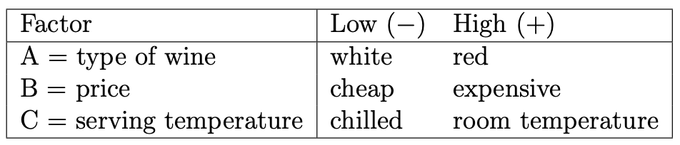
```

This design involves testing all possible combinations of these factors and their levels, resulting in $2^3 = 8$ unique experimental runs.

The experiment included the following design features:

-   Blocking: Seven tasters are treated as seven blocks because each taster’s unique preferences, palate sensitivity, and potential biases introduce a potentially large source of variation of satisfaction ratings. Treating the tasters as blocks deals with this nuisance factor that is not of particular interest in this study. Each of the eight wine samples are applied to each block (i.e., all seven tasters scored all eight wine samples).

-   Randomization: The order of the eight experimental runs is randomized to minimize potential order effects and biases. R's `sample` function is utilized to randomly select the order of wine samples to be served.

#### Data Collection Procedure

Seven tasters participated in total, with each taster providing a satisfaction score for each of the eight samples. All tasters were blinded to the identity and attributes of the wines they evaluated to ensure that their ratings were based solely on sensory experience, thereby minimizing external influence. During each sampling, blindfolded tasters sampled the wine simultaneously in silence and indicated their satisfaction by holding up a number between 1 and 3, where 1 represented "awful", 2 represented "neutral", and 3 represented "amazing". This process was designed to capture immediate satisfaction responses without being influenced by others' scores.

The table below illustrates the design matrix for our wine tasting experiment, including raw wine satisfaction scores from all seven tasters.

```{r, echo=FALSE, out.width = '60%'}
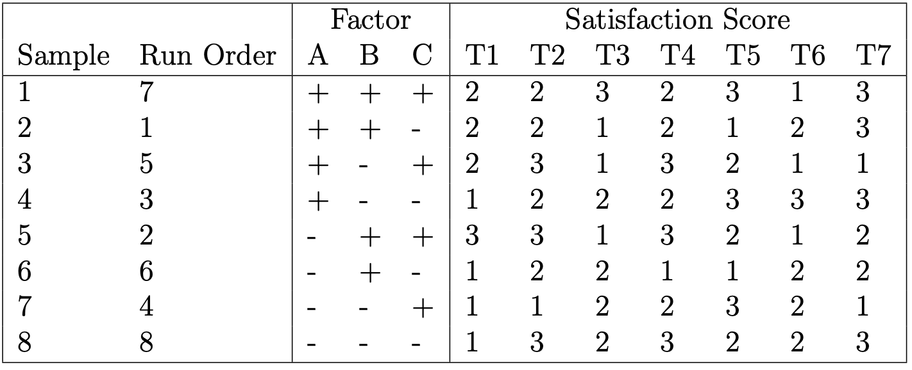
```

#### Statistical Analysis

Data pre-processing and statistical analysis were conducted in `R`. Factor levels of "-" and "+" as shown in design matrix were coded as "-1" and "1", respectively. For analysis, the `lm` function was called (satisfaction scores as a function of A, B, C (including two- and three-factor interactions), and the block effect) to assess the significance of each term. Factorial effects were subsequently computed by multiplying the regression estimates by 2. Residual analysis was performed to ensure model assumptions were appropriately met.

### Results

#### Exploratory Data Analysis

```{r, echo=FALSE, out.width = '70%'}
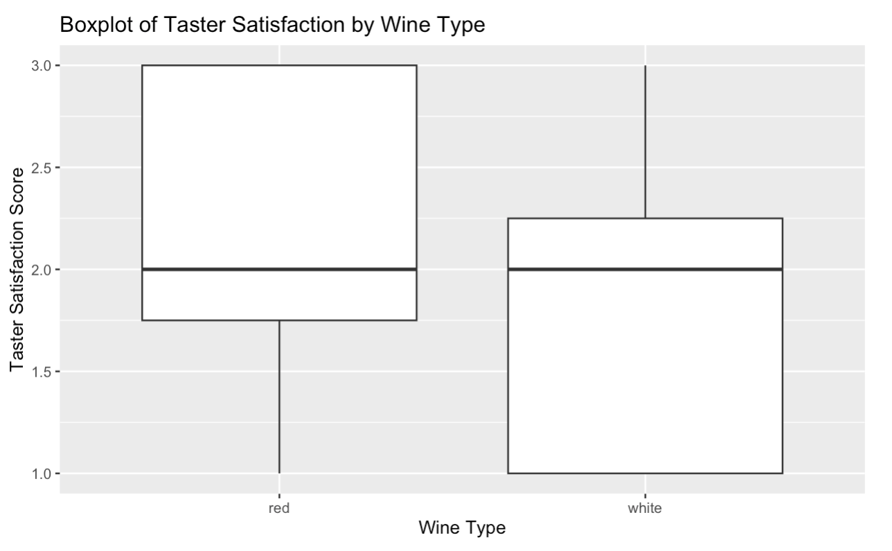
```

```{r, echo=FALSE, out.width = '70%'}
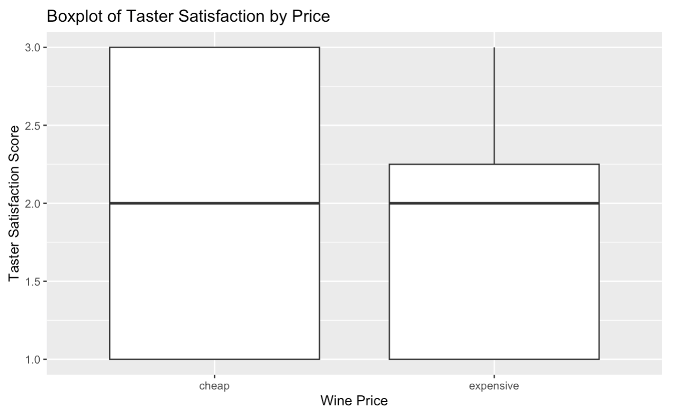
```

```{r, echo=FALSE, out.width = '70%'}
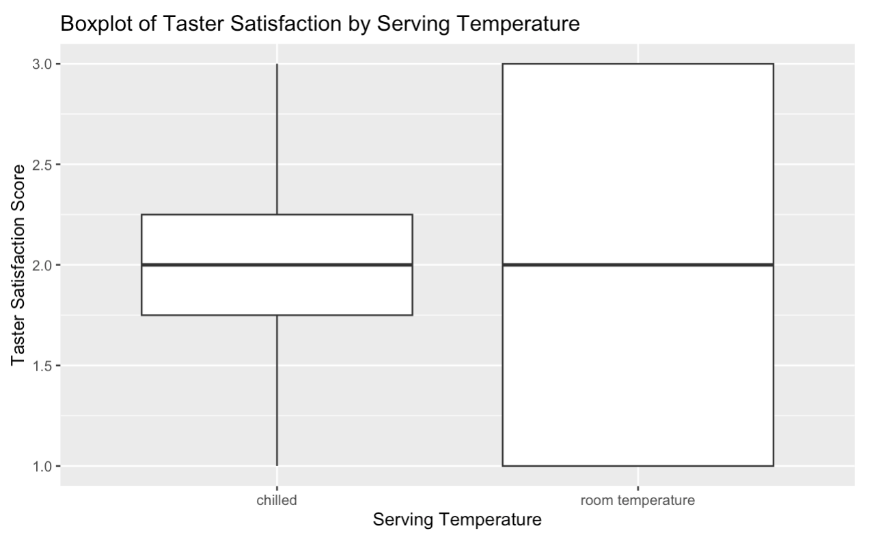
```

The figures above show boxplots of type, price, and temperature, respectively, by taster satisfaction. The boxplot of type compares white wine and red wine, showing the distribution of red wine satisfaction scores are skewed towards higher scores compared to white wines. The boxplot of price compares cheap wines and expensive wines, illustrating cheap wines have a wider spread of scores. The boxplot of serving temperature compares chilled samples and room-temperature samples, illustrating the wider spread of scores for room temperature samples. All three boxplots show that the levels for each of the three factors have the same median satisfaction scores and give some basic information about possible outliers, which will be explored in further analysis.

The figure below is a heatmap that illustrates cheap wines achieved higher average satisfaction scores when chilled and expensive wines achieved higher average satisfaction scores when room temperature. Furthermore, chilled expensive white wines received the lowest satisfaction scores, which challenges anecdotal evidence of this being a popular choice among wine drinkers.

```{r, echo=FALSE, out.width = '80%'}
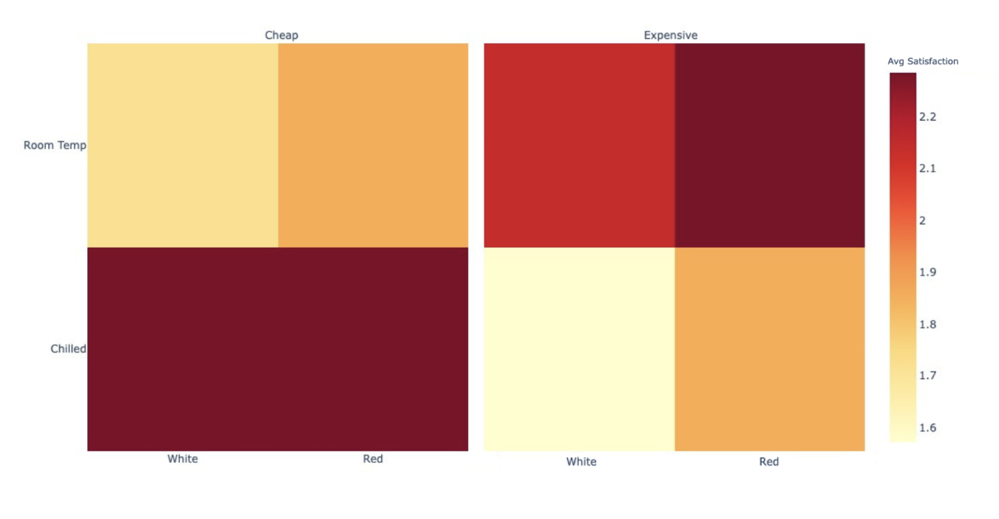
```

#### Significant Effects

```{r, echo=FALSE, out.width = '50%'}
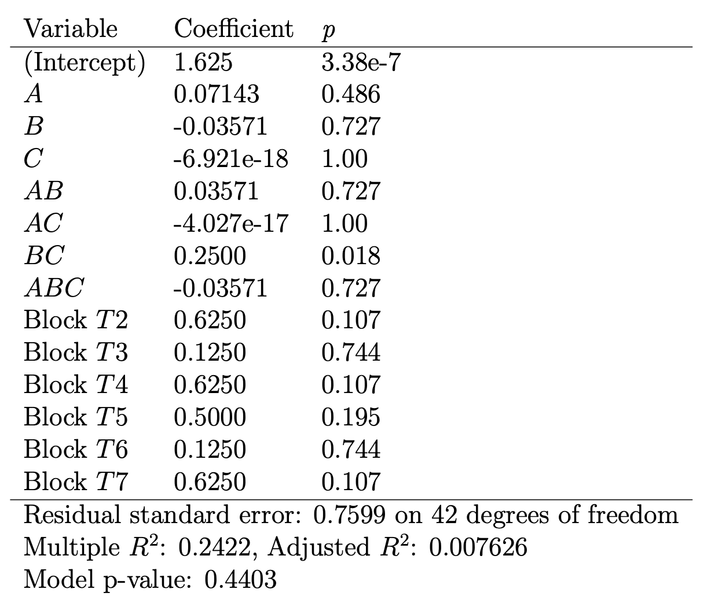
```

The above table summarizes the initial model output that includes all possible variables. The only significant term is $BC$, or the two-factor interaction of price and temperature, with a p-value of 0.018. Note that no main effects or other interaction effects are significant. Moreover, the block effect was not significant, signifying there was no significant difference in the mean responses from the testers. This suggests that block-specific factors (e.g., personal preference and taste differences) did not influence the wine satisfaction scores.

```{r, echo=FALSE, out.width = '70%'}
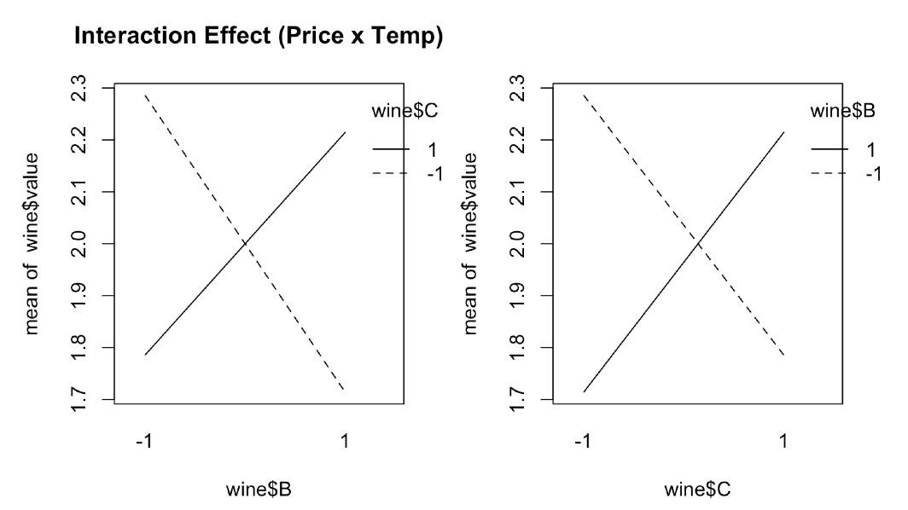
```

The figure above shows the interaction plots of price ($B$) and temperature ($C$), with the positions of the factors swapped in each plot to illustrate there are no major discrepancies that would need to be further investigated. For cheap wines, higher mean satisfaction scores were achieved when served chilled. On the other hand, expensive wines were scored higher on average when served at room temperature.


```{r, echo=FALSE, out.width = '70%'}
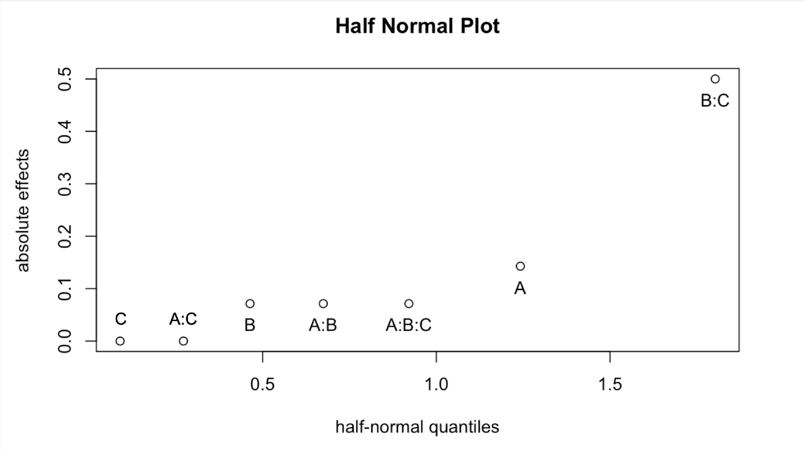
```

The half-normal plot shown above visualizes absolute factorial effects. As shown by our previous analysis, the interaction effect of $BC$, or price and temperature, is shown to be significant.

#### Residual Analysis

Residual analysis was conducted to ensure model assumptions were appropriately met. A residuals versus fitted plot is shown below. The major concerns revealed here are the presence of three outliers. However, due to the nature of our experiment and data collection, no data points are removed. The Q-Q residuals plot below shows that the assumption of normality is reasonable.

```{r, echo=FALSE, out.width = '70%'}
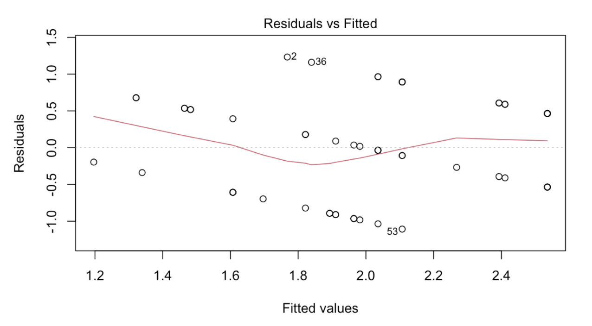
```

```{r, echo=FALSE, out.width = '70%'}
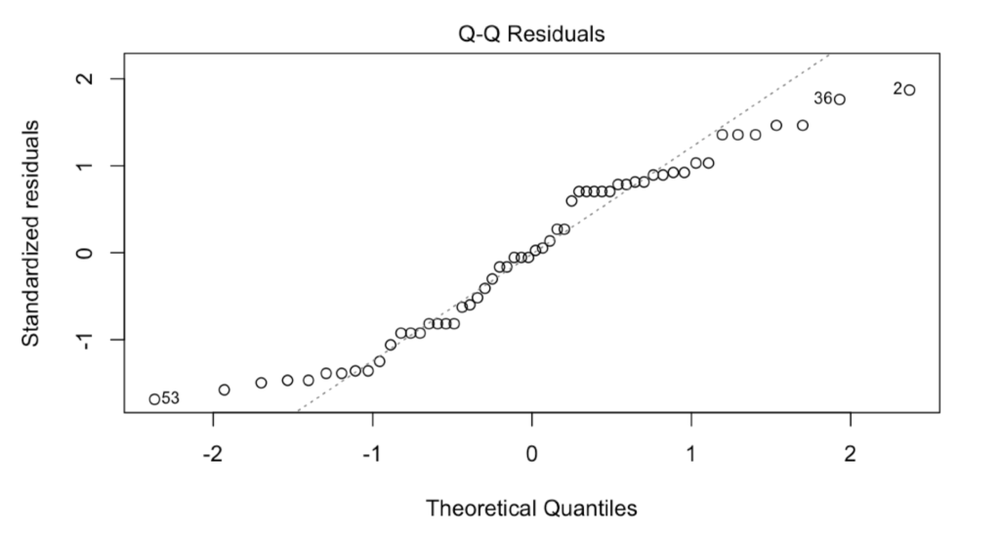
```

Note that a log and square root transformation were applied to the response variable, with no major changes in the model or results. Therefore, the response variable was kept as is for purposes of easier model interpretation.

### Discussion

While the results provide valuable insights, there are several factors and limitations worth considering. In traditional wine-tasting settings, white wines are typically tasted before red wines to prevent the heavier flavors of reds from influencing perceptions of whites. However, in this study, the randomized presentation of wine types led to deviations from standard tasting practices. While this randomization was necessary to reduce order effects, it may have inadvertently affected satisfaction scores, particularly for participants familiar with or sensitive to traditional tasting protocols.

Additionally, the typical serving temperatures of wines — whites chilled and reds at room temperature — align with the factor levels tested in this experiment. This alignment may reinforce pre-existing preferences, as tasters might be accustomed to these serving norms.

The price factor aimed to examine whether the expense of a wine impacts satisfaction. While the "expensive” wine used in the study was nearly three times the cost of the "cheap” wine, it may not meet the expectations of truly high-end wines. As a result, the findings may be less distinct than if we had utilized the true extremes of the wine market.

Although tasters were treated as blocks to control for individual differences, the relatively small number of participants limits the generalizability of the results. Increasing the number of tasters and trials could enhance the robustness of the findings. Future experiments could also include tasters with varying levels of wine expertise to explore how familiarity impacts satisfaction. Moreover, follow-up experiments can randomize the order of wines within each individual block.

Statistical analysis revealed that the only variable significantly affecting wine satisfaction scores is the interaction effect of price and temperature. Cheap wines are shown to be best served chilled while expensive wines are best served room temperature. The cooler serving temperatures of wines can help hide flaws, such as an imbalance in tannin, acidity, alcohol, body. This imbalance may be more pronounced in cheaper wines, which often have less strict wine-making requirements. Of course, this idea would require follow-up experiments to test.

Furthermore, we must keep in mind the Effect Heredity Principle, which states that in order for an interaction to be significant, at least one of its parent factors must be significant. Here, neither the main effects of price nor temperature were found to be significant. By this principle, we cannot confidently arrive at the conclusion that the interaction effect of price and temperature significantly affect wine satisfaction. The significance of this interaction effect can potentially be due to noise in our data. A confirmatory experiment should be done to retest these factors.

This current experiment can also serve as a screening experiment, in which the factors of type, price, and temperature can be ruled out and new factors (e.g., testing boxed, bottled, and canned wines) can be tested in subsequent experiments to further deepen our understanding of consumer wine preferences. Alternatively, expanding the range of levels for temperature, price, or wine type (e.g., introducing sparkling or dessert wines) could provide a broader understanding of consumer preferences.

Despite its limitations, this experiment underscores the importance of sensory and contextual factors in shaping wine satisfaction. By challenging traditional norms and exploring alternative presentations, the findings contribute to a growing body of knowledge that can inform serving practices, marketing strategies, and consumer education in the wine industry.

### Supplementary Figures

```{r, echo=FALSE, fig.cap = "Main Effects Plots", out.width = '65%', fig.align='left'}
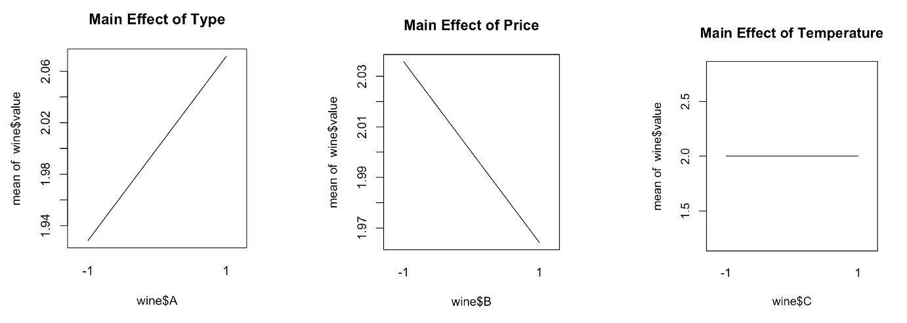
```

```{r, echo=FALSE, fig.cap = "Interaction Plot of Type and Price", out.width = '65%', fig.align='left'}
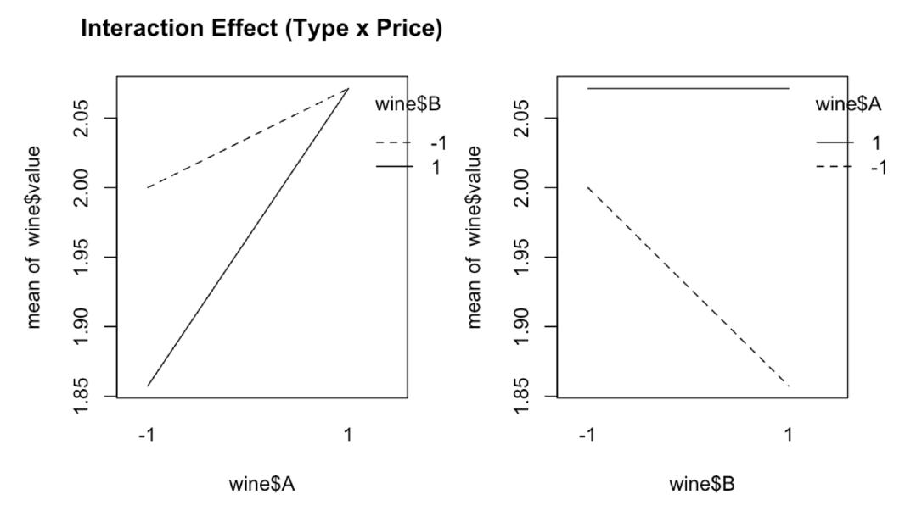
```

```{r, echo=FALSE, fig.cap = "Interaction Plot of Type and Temperature", out.width = '65%', fig.align='left'}
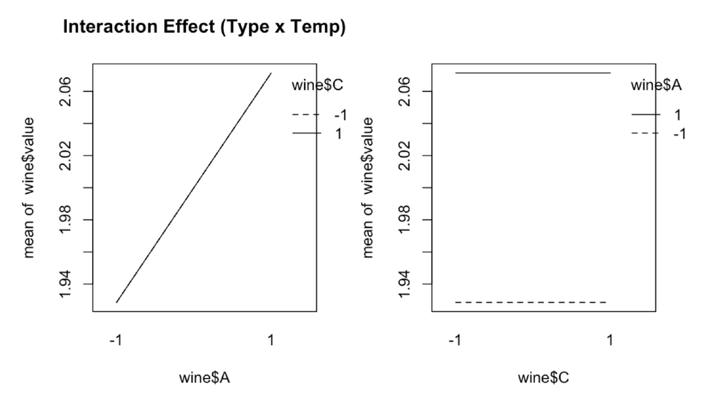
```

```{r, echo=FALSE, fig.cap = "Residual Analysis: Residuals vs. Tester/Block", out.width = '65%', fig.align='left'}
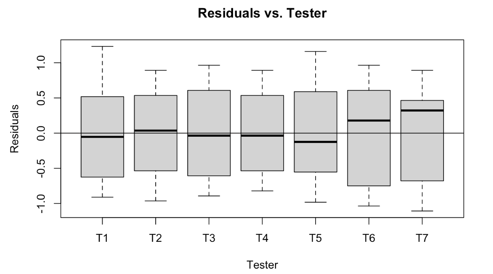
```
